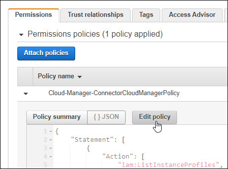

= AWS での Kubernetes クラスタの要件
:hardbreaks:
:nofooter: 
:icons: font
:linkattrs: 
:imagesdir: ../media/

[role="lead"]
AWS 上の管理対象の Amazon Elastic Kubernetes Service （ EKS ）クラスタまたは自己管理型の Kubernetes クラスタを Cloud Manager に追加できます。Cloud Manager にクラスタを追加する前に、次の要件を満たしていることを確認する必要があります。

このトピックでは、 _Kubernetes cluster_where configuration is the same for EKS and selfmanaged Kubernetes clusters を使用します。クラスタタイプは設定が異なる場所で指定します。

== 要件

Astra Trident:: Kubernetes クラスタには、 NetApp Astra Trident がインストールされている必要があります。最新バージョンの 4 つの Astra Trident が必要です。 https://docs.netapp.com/us-en/trident/trident-get-started/kubernetes-deploy-operator.html["インストール手順については、 Astra Trident のドキュメントを参照"^]。
Cloud Volumes ONTAP:: Cloud Volumes ONTAP for AWS は、クラスタのバックエンドストレージとしてセットアップする必要があります。 https://docs.netapp.com/us-en/trident/trident-use/backends.html["設定手順については、 Astra Trident のドキュメントを参照してください"^]。
Cloud Manager Connector の略:: 必要な権限を持つコネクタが AWS で実行されている必要があります。 <<Prepare a Connector,詳細は以下をご覧ください>>。
ネットワーク接続:: Kubernetes クラスタとコネクタの間、および Kubernetes クラスタと Cloud Volumes ONTAP の間にはネットワーク接続が必要です。 <<Review networking requirements,詳細は以下をご覧ください>>。
RBAC 許可:: Cloud Manager Connector ロールは、各 Kubernetes クラスタで許可されている必要があります。 <<Set up RBAC authorization,詳細は以下をご覧ください>>。

== コネクタを準備します

Kubernetes クラスタを検出および管理するには、 AWS で Cloud Manager Connector を使用する必要があります。新しいコネクターを作成するか、必要な権限を持つ既存のコネクターを使用する必要があります。

=== 新しいコネクターを作成します

次のリンクのいずれかの手順に従います。

* https://docs.netapp.com/us-en/cloud-manager-connector/task-creating-connectors-aws.html["Cloud Manager からコネクタを作成します"^] （推奨）
* https://docs.netapp.com/us-en/cloud-manager-connector/task-launching-aws-mktp.html["AWS Marketplace からコネクタを作成します"^]
* https://docs.netapp.com/us-en/cloud-manager-connector/task-installing-linux.html["AWS の既存の Linux ホストにコネクタをインストールします"^]

=== 必要な権限を既存のコネクタに追加します

3.9.13 リリース以降、 new_newly で作成されたコネクタには、 Kubernetes クラスタの検出と管理を可能にする新しい AWS 権限が 3 つ含まれています。このリリースよりも前のリリースでコネクタを作成していた場合は、権限を付与するために、コネクタの IAM ロールの既存のポリシーを変更する必要があります。

.手順
. AWS コンソールにアクセスして EC2 サービスを開きます。
. コネクタインスタンスを選択し、 * セキュリティ * をクリックして、 IAM ロールの名前をクリックし、 IAM サービスでロールを表示します。
+
image:screenshot-aws-iam-role.png["Security タブで IAM ロールの名前を示す AWS コンソールのスクリーンショット。"]

. [* アクセス許可 *] タブで、ポリシーを展開し、 [ * ポリシーの編集 * ] をクリックします。
+

. JSON * をクリックして、最初のアクションセットに次の権限を追加します。
+
[source, json]
----
"eks:ListClusters",
"eks:DescribeCluster,"
"iam:GetInstanceProfile"
----
+
https://occm-sample-policies.s3.amazonaws.com/Policy_for_Cloud_Manager_3.9.13.json["ポリシーの完全な JSON 形式を表示します"^]。

. [ ポリシーの確認 ] をクリックし、 [ 変更の保存 ] をクリックします。

== ネットワーク要件を確認します

Kubernetes クラスタとコネクタの間、および Kubernetes クラスタとクラスタにバックエンドストレージを提供する Cloud Volumes ONTAP システムとの間にネットワーク接続を提供する必要があります。

* 各 Kubernetes クラスタがコネクタからインバウンド接続を確立している必要があります
* コネクタには、ポート 443 経由で各 Kubernetes クラスタへのアウトバウンド接続が必要です

この接続を確立する最も簡単な方法は、 Kubernetes クラスタと同じ VPC にコネクタと Cloud Volumes ONTAP を導入することです。VPC が確立されていない場合は、 VPC 間に VPC ピアリング接続を設定する必要があります。

以下は、同じ VPC 内の各コンポーネントの例です。

image:diagram-kubernetes-eks.png["EKS の Kubernetes クラスタのアーキテクチャ図と、同じ VPC 内のコネクタと Cloud Volumes ONTAP への接続。"]

別の VPC で実行されている EKS クラスタを次に示します。この例では、 VPC ピアリングによって、 EKS クラスタの VPC とコネクタおよび Cloud Volumes ONTAP の VPC 間の接続が確立されます。

image:diagram_kubernetes.png["EKS Kubernetes クラスタのアーキテクチャ図と、別の VPC 内のコネクタと Cloud Volumes ONTAP への接続。"]

== RBAC 許可をセットアップします

コネクタがクラスタを検出して管理できるように、各 Kubernetes クラスタで Connector ロールを承認する必要があります。

.手順
. クラスタロールとロールバインドを作成します。
+
.. 次のテキストを含む YAML ファイルを作成します。
+
[source, yaml]
----
apiVersion: rbac.authorization.k8s.io/v1
kind: ClusterRole
metadata:
    name: cloudmanager-access-clusterrole
rules:
    - apiGroups:
          - ''
      resources:
          - secrets
          - namespaces
          - persistentvolumeclaims
          - persistentvolumes
      verbs:
          - get
          - list
          - create
    - apiGroups:
          - storage.k8s.io
      resources:
          - storageclasses
      verbs:
          - get
          - list
    - apiGroups:
          - trident.netapp.io
      resources:
          - tridentbackends
          - tridentorchestrators
      verbs:
          - get
          - list
---
apiVersion: rbac.authorization.k8s.io/v1
kind: ClusterRoleBinding
metadata:
    name: k8s-access-binding
subjects:
    - kind: Group
      name: cloudmanager-access-group
      apiGroup: rbac.authorization.k8s.io
roleRef:
    kind: ClusterRole
    name: cloudmanager-access-clusterrole
    apiGroup: rbac.authorization.k8s.io
----
.. クラスタに構成を適用します。
+
[source, kubectl]
----
kubectl apply -f <file-name>
----

. 権限グループへの ID マッピングを作成します。
+
[role="tabbed-block"]
====
.eksctl を使用します
--
eksctl を使用して、クラスタと Cloud Manager Connector 用の IAM ロールの間に IAM ID マッピングを作成します。

https://eksctl.io/usage/iam-identity-mappings/["eksctl のマニュアルを参照してください"^]。

以下に例を示します。

[source, eksctl]
----
eksctl create iamidentitymapping --cluster <eksCluster> --region <us-east-2> --arn <ARN of the Connector IAM role> --group cloudmanager-access-group --username system:node:{{EC2PrivateDNSName}}
----
--
.aws -auth を編集します
--
AWS- auth ConfigMap を直接編集して、 Cloud Manager Connector の IAM ロールに RBAC アクセスを追加します。

https://docs.aws.amazon.com/eks/latest/userguide/add-user-role.html["詳細な手順については、 AWS EKS のドキュメントを参照してください"^]。

以下に例を示します。

[source, yaml]
----
apiVersion: v1
data:
  mapRoles: |
    - groups:
      - cloudmanager-access-group
      rolearn: <ARN of the Connector IAM role>
     username: system:node:{{EC2PrivateDNSName}}
kind: ConfigMap
metadata:
  creationTimestamp: "2021-09-30T21:09:18Z"
  name: aws-auth
  namespace: kube-system
  resourceVersion: "1021"
  selfLink: /api/v1/namespaces/kube-system/configmaps/aws-auth
  uid: dcc31de5-3838-11e8-af26-02e00430057c
----
--
====

